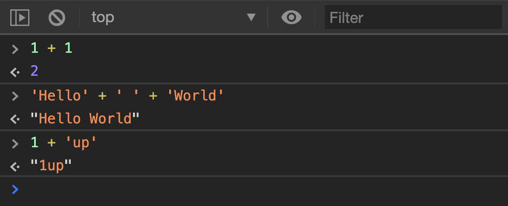

Step 1: Clone Repo Step 2: run npm

_**Explain OOP principles using JavaScript_**

While object oriented programming (OOP) can be a mouth full, and 
increase in complexity rapidly. A basic idea to describe it
is to think of OOP as a way computer scientists have 
found to represent physical things. An _Object_ is a 
representation, or a model, of real world stuff in a computer program.
Ultimately providing a simple way to create functionality that
otherwise might be impossible to use. (MDN Contributors, 2021).

**The Four Principles of OOP**

**Encapsulation**

Encapsulation is the bundling of data, and the methods that 
have access to, and modify it. Through encapsulation, it is possible hide an 
objects state (data) and restrict outside changes. (Elliot, 2019)

An example of encapsulation is the definition of an object through 
a class in JavaScript:

class Calculation {
//the constructor is the first method called after instantiation
// and usually sets the properties of the object, in other words stores
//the values of each private variable

constructor(a, b, op){
//The "this" keyword is an internal reference of the object to
// access its methods and properties
this.a = a;
this.b = b;
this.op = op;
}
//get results is an example of a method that has access to the 
//data stored during instantiation
GetResults() {
return this.op(this.a, this.b)
}
}

module.exports = Calculation;

**Abstraction**

Abstraction offers a high level view of the object instead of the 
whole source code. It makes the public methods available with enough 
information to apply them. An example for abstraction can be 
encountered in any electronic device, where the buttons and other 
details offer a simplistic version of how to operate the device, 
while the underlying logic and circuitry connect the high level, and 
the lower level architecture to produce desired outcomes.

**Inheritance**

Inheritance mimics a parent child relationship in that it transfers
previously defined code into the child class. Thus reducing the amount
of code being written. The child class inherits all fields and methods
of the parent class, in addition to implementing it's own.

In the following class definition, Calculation inherits Squares'
constructor and initializes the properties a, and op from the
Squares class. While also creating the property b to store a 
second value in the calculation.

const Squares = require('./Squares');

class Calculation extends Squares{
//the constructor is the first method called after instantiation
// and usually sets the properties of the object
constructor(a, b, op){
//"this" is the internal reference of the object to
// access its methods and properties
super(a,op);
this.b = b;
}
//get results is a method so that it can return back the results
// of the calculation
GetResults() {
return this.op(this.a, this.b)
}
}

module.exports = Calculation;

**Polymorphism**

Polymorphism offers an opportunity to redefine functions within a class,
or within a child class. All while offering an intuitiveness to the 
program so it knows which form of the method to utilize when it's called.

In some sense of the word, polymorphism is the ability to take on
different forms. In Javascript there are three polymorphism
types of polymorphism.

1. Adhoc Polymorphism
2. Parametric Polymorphism
3. Subtype Polymorphism

**Adhoc Polymorphism**

Adhoc polymorphism means to change something without 
planning, or on the spot. It also has three subcategories:

1.Operator overloading
Means to be able to do more than one thing. 
An example is the plus sign + that is used with integers 
and to concatenate strings.

The following code snippet taken from Zell 
illustrates the afford mentioned.

`// Adding numbers
1 + 1 // Results in 2

// Adding Strings
'Hello' + ' ' + 'World' // Results in 'Hello World'

// Adding Numbers to Strings
1 + 'up' // Results in '1up'`

(Zell, 2020)

When Concatenating the result's type may change 

Numbe + Number = Number
Number + String = String

The + operator allows you to change the value's 
type.

2.Function overloading

3.Coercion Polymorphism

**Parametric Polymorphism**
**Subtype Polymorphism**

MDN Contributors. (2021). Object-oriented JavaScript for beginners. MDN Web Docs. Retrieved from https://developer.mozilla.org/en-US/docs/Learn/JavaScript/Objects/Object-oriented_JS

Elliot, E. (2019). Encapsulation in JavaScript. JavaScript Scene. Retrieved from https://medium.com/javascript-scene/encapsulation-in-javascript-26be60e325b4
Zell. (2020). Polymorphism in JavaScript. Zellwk. Retrieved from https://zellwk.com/blog/polymorphism-javascript/